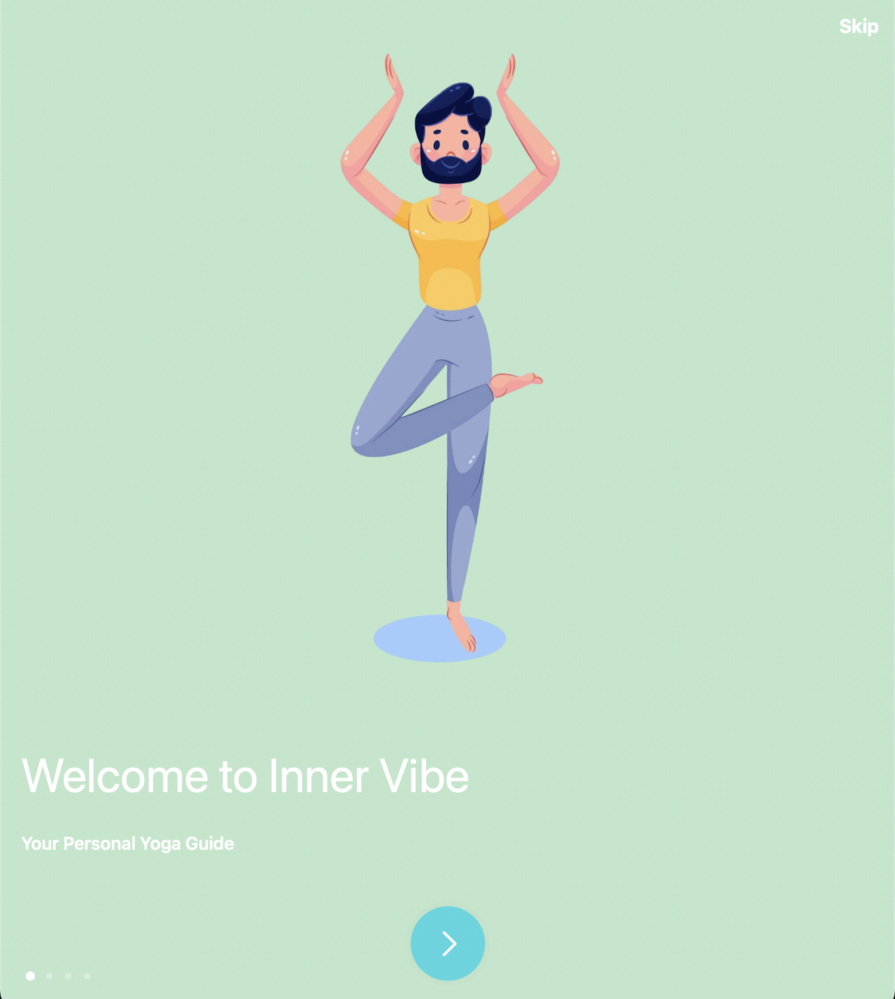
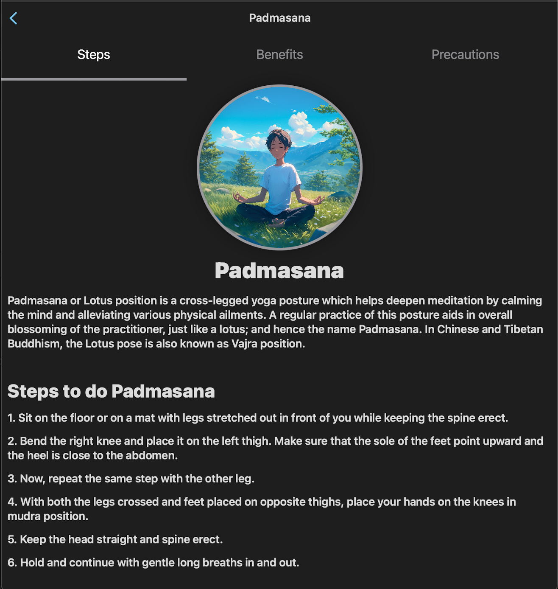
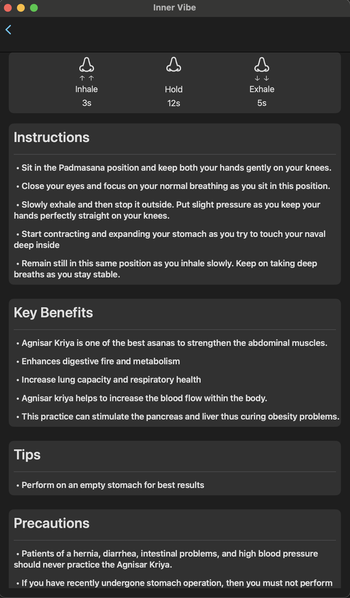
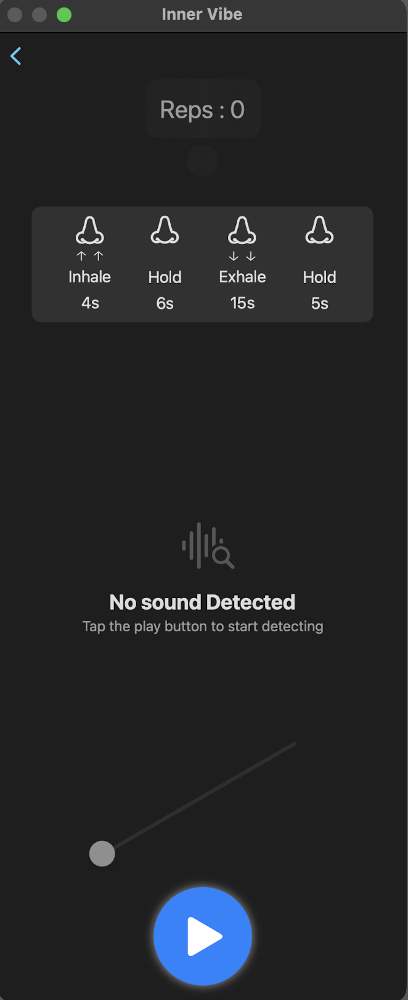

# 🧘 Inner Vibe – Yoga & Pranayama App  
*A SwiftUI app designed for the Swift Student Challenge 2025*  



## 📌 Features  

### 🏋️‍♂️ Yoga Asana Mode  
- Select from a list of yoga asanas.  
- View **detailed steps, benefits, precautions, and a demo video** for each asana.  
- Start a **guided practice mode** with real-time **pose classification using an ML model**.  
- **Live camera tracking** records the time held in the pose.  
- **Automatically stops the timer** if the user breaks the pose.  
- **Best hold time tracking** for each asana.  

### 🌬️ Pranayama Mode  
- Choose from **five types of pranayama**.  
- Get **detailed instructions, benefits, tips, and breathing time intervals**.  
- Animated **breath cycle visualization** (inhale → hold → exhale).  
- **Real-time sound classification** detects inhale, exhale, and silence using an ML model.  
- Cycle counter to track breathing repetitions.  

### 🔥 Streak Tracker  
- **Tracks daily usage streaks** to motivate consistency.  

---

## 📸 Screenshots  

### Asana Instructions


### Asana Practice (Live Camera)


### Pranayama Instuctions 


### Pranayama Practice  


---

## 🛠️ Technologies Used  
- **SwiftUI** for UI/UX.  
- **CoreML & Vision** for live yoga pose recognition.  
- **Sound analysis** for pranayama breath classification.  
- **AVFoundation** for video playback.  
- **UserDefaults** for tracking streaks.  

---

## 🚀 Installation  
1. Clone the repository:  
   ```bash
   git clone https://github.com/Tsh007/InnerVibe.git
   cd InnerVibe

## 👨‍💻 Author
### Tejash

### 🚀 iOS Developer | ML Enthusiast
### 📧 Email: 22cd3032@rgipt.ac.in
